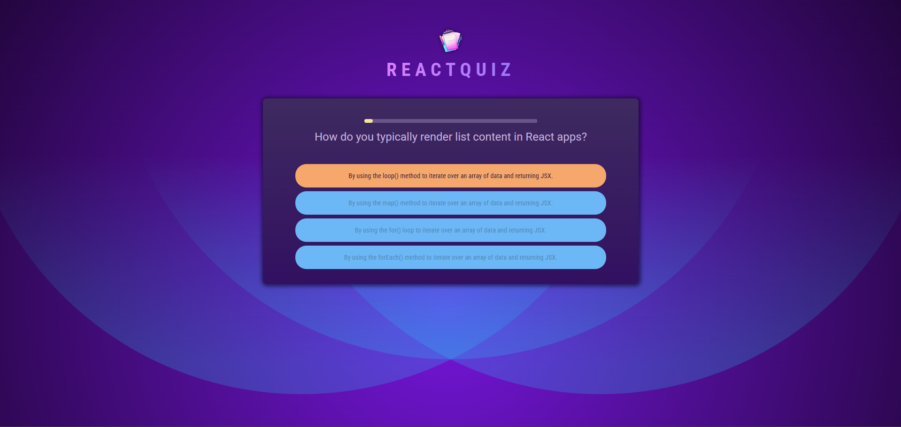
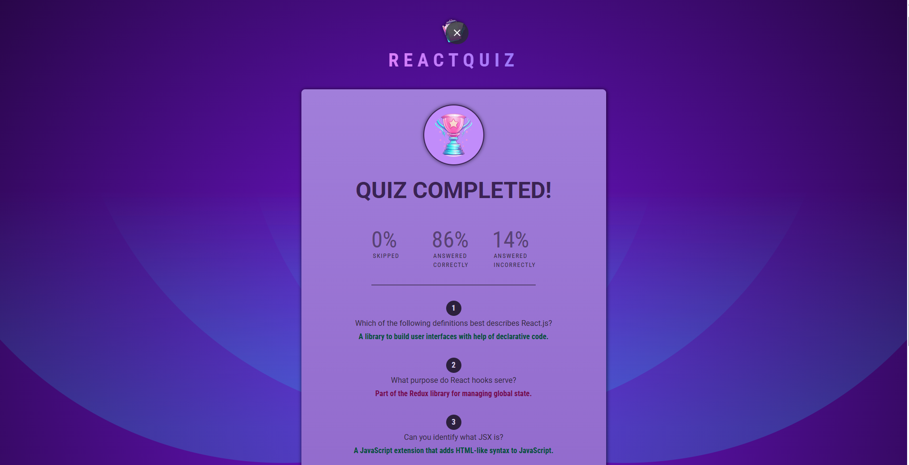

# React + Vite Quiz App

This project was developed to sharpen my skills in **React JS** and served as part of a course to demonstrate how coding can be both a rewarding and enjoyable experience. 
It’s a perfect example of how learning, experimentation, and creativity come together to create something both practical and fun. 
The app highlights my journey of improving my development skills while having a great time solving problems and exploring new concepts along the way.

## 🚀Getting Started

### Run Locally

Clone the repository:

```bash
git clone https://github.com/dimitrisAvgoustopoulos/react-quiz-app.git
```

Navigate to the project directory:

```bash
cd react-quiz-app
```

Install the dependencies:

```bash
npm install
```

Start the development server:

```bash
npm run dev
```

## Screenshots

<br><br>


